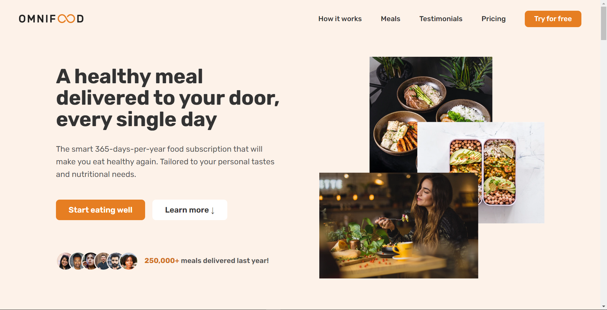

# Omnifood Project

An AI-powered food subscription that will make you eat healthy again, 356 days per year. It's tailored to your personal tastes and nutritional needs.

## Table of contents

- [Overview](#overview)
  - [The challenge](#the-challenge)
  - [Screenshot](#screenshot)
  - [Links](#links)
- [My process](#my-process)
  - [Built with](#built-with)
  - [What I learned](#what-i-learned)
- [Author](#author)
- [Acknowledgments](#acknowledgments)

## Overview

### The challenge

Users should be able to:

- Easily navigate to sections using the navigation
- See animations to images or cards when hovered
- Experience responsive design and layout using modern CSS3 teachniques

### Screenshot

### Links

- Live Site URL: [https://quiel-omnifood.netlify.app/](https://quiel-omnifood.netlify.app/)

## My process

This is the last and the biggest project I made through using HTML5, CSS3, and JavaScript. It was very challenging especially the part where you must always think about how the project is gonna work and look in different browsers and device.

### Built with

- Semantic HTML5
- CSS3
- JavaScript

### What I learned

I learned in this project is that it is very important to always think how the project is gonna work and look in different browsers and device. We must optimize everything especially the images used before deployment.

## Author

- GitHub - [quielLovesLasagna](https://github.com/quielLovesLasagna)

## Acknowledgments

I would like to thank [Jonas Schmedtmann](https://twitter.com/jonasschmedtman) and his team for teaching and helping me and everyone else throughout the course.
